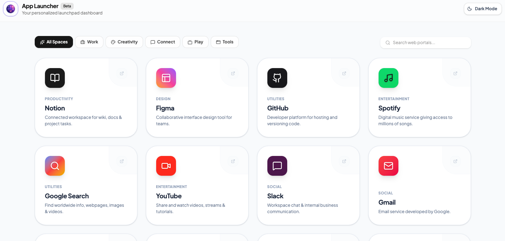

# App Launcher

A personalized launchpad dashboard that displays your web apps as a grid of cards, with category filters, search, and light/dark themes. Built with React, Vite, and Tailwind CSS.



## Run Locally

**Prerequisites:** [Node.js](https://nodejs.org) and [pnpm](https://pnpm.io). If you have a recent Node.js, you can enable pnpm with `corepack enable`.

1. Install dependencies:
   ```bash
   pnpm install
   ```
2. Start the dev server (runs on http://localhost:3000):
   ```bash
   pnpm dev
   ```

Other scripts:

- `pnpm build` — build a production bundle into `dist/`
- `pnpm preview` — preview the production build locally
- `pnpm lint` — type-check the project with `tsc`

## Managing Cards

Each card on the launcher is an entry in [src/apps.json](src/apps.json). Edit that file to add or remove cards — the grid updates automatically when you save (the dev server hot-reloads).

### Card format

Every card is an object with the following fields:

```json
{
  "id": "notion",
  "title": "Notion",
  "description": "Connected workspace for wiki, docs & project tasks.",
  "url": "https://www.notion.so",
  "iconName": "BookOpen",
  "bgColor": "bg-[#1a1a1a]",
  "textColor": "text-white",
  "category": "productivity"
}
```

| Field         | Description                                                                                                                                                        |
| ------------- | ------------------------------------------------------------------------------------------------------------------------------------------------------------------ |
| `id`          | Unique identifier for the card (must not duplicate another card's id).                                                                                             |
| `title`       | Display name shown on the card.                                                                                                                                    |
| `description` | Short blurb shown under the title. Also searched by the search bar.                                                                                                |
| `url`         | Link the card opens when clicked.                                                                                                                                  |
| `iconName`    | A [Lucide](https://lucide.dev/icons/) icon name (e.g. `BookOpen`, `Github`, `Music`). Falls back to a `Link` icon if the name isn't found.                         |
| `bgColor`     | Tailwind class for the icon tile background, e.g. `bg-zinc-900`, `bg-[#1ed760]`, or a gradient like `bg-gradient-to-tr from-amber-500 via-pink-500 to-violet-500`. |
| `textColor`   | Tailwind text-color class for the icon, e.g. `text-white` or `text-[#1a1a1a]`.                                                                                     |
| `category`    | One of: `productivity`, `design`, `social`, `entertainment`, `utilities`. Controls which category filter the card appears under.                                   |

Categories are defined in [src/data.ts](src/data.ts) (`CATEGORIES`). The `all` filter shows every card.

### Add a card

Add a new object to the array in [src/apps.json](src/apps.json). For example, to add a Notion card:

```json
{
  "id": "my-app",
  "title": "My App",
  "description": "What this app does.",
  "url": "https://example.com",
  "iconName": "Compass",
  "bgColor": "bg-indigo-600",
  "textColor": "text-white",
  "category": "productivity"
}
```

Tips:

- Pick any icon name from [lucide.dev/icons](https://lucide.dev/icons/).
- Make sure `id` is unique and `category` is one of the values listed above.
- Keep the file valid JSON — commas between objects, no trailing comma after the last one.

### Remove a card

Delete that card's object from the array in [src/apps.json](src/apps.json) (including its surrounding `{ ... }` and the trailing comma if it isn't the last entry).
